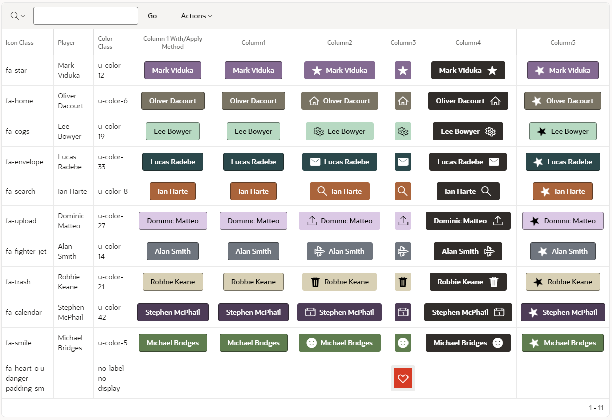

<h1> Pretius Button Builder Plugin </h1>

  

- [What is the Pretius APEX Button Builder Plugin](#what-is-button-builder-plugin)
- [Release History](#release-history)
- [Installation](#installation)
- [Plugin Usage](#usage)
- [Plugin Settings](#settings)
- [License](#license)
- [Free Support](#free-support)
- [Commercial Support](#commercial-support)

## What is Button Builder Plugin

Pretius Button Builder Plugin is an Oracle APEX region plugin developed by [Matt Mulvaney](https://twitter.com/Matt_Mulvaney) at <a href="https://www.pretius.com" title="https://www.pretius.com">Pretius</a>. 

This Plugin is a reimagining of Universal Theme's [Button Builder](https://apex.oracle.com/pls/apex/r/apex_pm/ut/button-builder) as a Single Template Component. 

This allows you to show buttons in IR Columns with identical settings to the Universal Theme's Button Builder plus two new settings (Link & Custom Classes). See [Plugin settings](#settings) for more features.




## Release History
23.2.1: November 2023

 - Initial version


## Installation
1. Download the plug-in file from the latest release
2. Import the plug-in file into your application

## Usage

There are two usage methods for IR Columns. 
  - The Plugin Method is easiest to configure however users will **not** be able to sort or filter the column.
  - The HTML Expression Method is more advanced to configure however users will be able to sort and filter the column.

### Plugin Method

1. Assign an IR Column to Type **Button Builder**
2. Keep all the Plugin settings as default or change as required

### HTML Expression Method

1. Assign the HTML Expression of the IR Column to the sample code below or change as required

    ```
    {with/}
        BUTTON_TEMPLATE:=TEXT
        LABEL:=My Button
        ICON_CLASS:=fa-check-circle
        CSS_CLASSES:=
        HOT:=N
        LINK:=
        SIZE:=DEFAULT
        TYPE:=NORMAL
        STYLE:=DEFAULT
        ICON_POSITION:=LEFT
        BUTTON_SET:=DEFAULT
        WIDTH:=AUTO
        SPACING_LEFT:=DEFAULT
        SPACING_RIGHT:=DEFAULT
        ICON_CLASS:=DEFAULT
        SPACING_TOP:=DEFAULT
        SPACING_BOTTOM:=DEFAULT
    {apply COM.PRETIUS.APEX.BUTTON_BUILDER/}
    ```

2. Change above settings as required
3. For links, you can use expressions like this

      ```
      LINK:=f?p=&APP_ID.:3:&APP_SESSION.::NO:RP:P3_NAME:#NAME#
      ```
      or call a JavaScript like this
      ```
      LINK:=javascript:apex.message.alert("MOT")
      ```

## Settings


| Name                  | Value                                                                                   |
|-----------------------|-----------------------------------------------------------------------------------------|
| Button Template       | Text, Text with Icon or Icon                                                            |
| Label                 | The label for the button. Plain Text, #COLUMN# and &COLUMN. substitutions are accepted  |
| Icon Class            | Font APEX Icon to be displayed e.g fa-check-circle &COLUMN. Substitutions are accepted  |
| CSS Classes           | Additonal CSS classes e.g u-color-10 u-hot                                              |
| Hot                   | Hot Button using Theme consistant colours                                               |
| Link                  | Link when clicked                                                                       |
| Size                  | Tiny, Small, Normal (default) Or Large Button                                           |
| Type                  | Stateful colors: normal, informational, danger, warning, and success                    |
| Style                 | Normal, Simple, Remove UI Decorations or Display as Link                                |
| Icon Position         | When Button Template is Text with Icon, show the icon left or right of the label        |
| Button Set            | Button Set, First, Inner or Last Button. Default is Normal                              |
| Width                 | Auto adjust to label width or stretch                                                   |
| Spacing Left          | Spacing Left: Small, Default or Large                                                   |
| Spacing Right         | Spacing Right: Small, Default or Large                                                  |
| Spacing Top           | Spacing Top: Small, Default or Large                                                    |
| Spacing Bottom        | Spacing Bottom: Small, Default or Large                                                 |

**Note**: A design decision was made not to render the button if the Label is null as the button looks unsual as **Text** or **Text with Icon**.
Whilst the button looks fine as **Icon**, there would be no Tooltip rendered therefore losing accessibility features. As such a Label is **always** required to render a button, even for Icon buttons. If you **really** need a blank button you can use the **\&nbsp\;** syntax as per the **COLUMN3** example below or copy this character --> <-- as your label.

## Demo Application
You can find a Demo Application [here](https://apex.oracle.com/pls/apex/r/luf/button-builder).
 


In the Demo Application, the following Plug-in Settings are used

| Setting               | Column1        | Column2          | Column3          | Column4         | Column5                |
|-----------------------|----------------|------------------|------------------|-----------------|------------------------|
| Button Template       | Text           | Text with Icon   | Icon             | Text with Icon  | Text with Icon         |
| Label                 | &PLAYER.       | &PLAYER.         | &PLAYER.\&nbsp\; | &PLAYER.        | &PLAYER.               |
| Icon Class            |                | &ICON_CLASS.     | &ICON_CLASS.     | &ICON_CLASS.    | fa-star fa-anim-spin   |
| CSS Classes           | &COLOR_CLASS.  | &COLOR_CLASS.    | &COLOR_CLASS.    |                 | &COLOR_CLASS.          |
| Hot                   | N              | N                | N                | N               | Y                      | 
| Style                 | Simple         | Default          | Default          |Default          |Simple                  |

_All Other Setting are Default_
    
The SQL Statement for the [Demo Application](https://apex.oracle.com/pls/apex/r/luf/button-builder) is

```
WITH static_json AS (
    SELECT 
'[
    {"player": "Mark Viduka", "icon_class": "fa-star", "color_class": "u-color-12", "hot": "u-hot", "display": "Y"},
    {"player": "Oliver Dacourt", "icon_class": "fa-home", "color_class": "u-color-6", "hot": null, "display": "Y"},
    {"player": "Lee Bowyer", "icon_class": "fa-cogs", "color_class": "u-color-19", "hot": "u-hot", "display": "Y"},
    {"player": "Lucas Radebe", "icon_class": "fa-envelope", "color_class": "u-color-33", "hot": null, "display": "Y"},
    {"player": "Ian Harte", "icon_class": "fa-search", "color_class": "u-color-8", "hot": "u-hot", "display": "Y"},
    {"player": "Dominic Matteo", "icon_class": "fa-upload", "color_class": "u-color-27", "hot": "u-hot", "display": "Y"},
    {"player": "Alan Smith", "icon_class": "fa-fighter-jet", "color_class": "u-color-14", "hot": null, "display": "Y"},
    {"player": "Robbie Keane", "icon_class": "fa-trash", "color_class": "u-color-21", "hot": null, "display": "Y"},
    {"player": "Stephen McPhail", "icon_class": "fa-calendar", "color_class": "u-color-42", "hot": "u-hot", "display": "Y"},
    {"player": "Michael Bridges", "icon_class": "fa-smile", "color_class": "u-color-5", "hot": null, "display": "Y"},
    {"player": null, "icon_class": "fa-heart-o u-danger padding-sm", "color_class": "no-label-no-display", "hot": null, "display": "Y"}
]' AS json_data
    FROM dual
)
SELECT j.*,
     null column1,
     player col2_with_apply,
     null column2,
     null column3,
     null column4,
     null column5
FROM static_json, JSON_TABLE(
    static_json.json_data,
    '$[*]'
    COLUMNS (
        player VARCHAR2 PATH '$.player',
        icon_class VARCHAR2 PATH '$.icon_class',
        color_class VARCHAR2 PATH '$.color_class',
        hot VARCHAR2 PATH '$.hot'
    )
) j
```

## Tips

The Pretius Button Builder Plugin Template Component looks best when both the IR Column **Heading Alignment** & **Column Alignment** are center Aligned


## License

Licensed under the [MIT](LICENSE) license.

## Free support
Pretius provides free support for the plugins at the GitHub platform. 
We monitor raised issues, prepare fixes, and answer your questions. However, please note that we deliver the plug-ins free of charge, and therefore we will not always be able to help you immediately. 

Interested in better support? 
* [Become a contributor!](#become-a-contributor) We always prioritize the issues raised by our contributors and fix them for free.
* [Consider comercial support.](#commercial-support) Options and benefits are described in the chapter below.

### Bug reporting and change requests
Have you found a bug or have an idea of additional features that the plugin could cover? Firstly, please check the Roadmap and Known issues sections. If your case is not on the lists, please open an issue on a GitHub page following these rules:
* issue should contain login credentials to the application at apex.oracle.com where the problem is reproduced;
* issue should include steps to reproduce the case in the demo application;
* issue should contain description about its nature.

### Implementation issues
If you encounter a problem during the plug-in implementation, please check out our demo application. We do our best to describe each possible use case precisely. If you can not find a solution or your problem is different, contact us: apex-plugins@pretius.com.

## Become a contributor!
We consider our plugins as genuine open source products, and we encourage you to become a contributor. Help us improve plugins by fixing bugs and developing extra features. Comment one of the opened issues or register a new one, to let others know what you are working on. When you finish, create a new pull request. We will review your code and add the changes to the repository.

By contributing to this repository, you help to build a strong APEX community. We will prioritize any issues raised by you in this and any other plugins.

## Commercial support
We are happy to share our experience for free, but we also realize that sometimes response time, quick implementation, SLA, and instant release for the latest version are crucial. That’s why if you need extended support for our plug-ins, please contact us at apex-plugins@pretius.com.
We offer:
* enterprise-level assistance;
* support in plug-ins implementation and utilization;
* dedicated contact channel to our developers;
* SLA at the level your organization require;
* priority update to next APEX releases and features listed in the roadmap.


